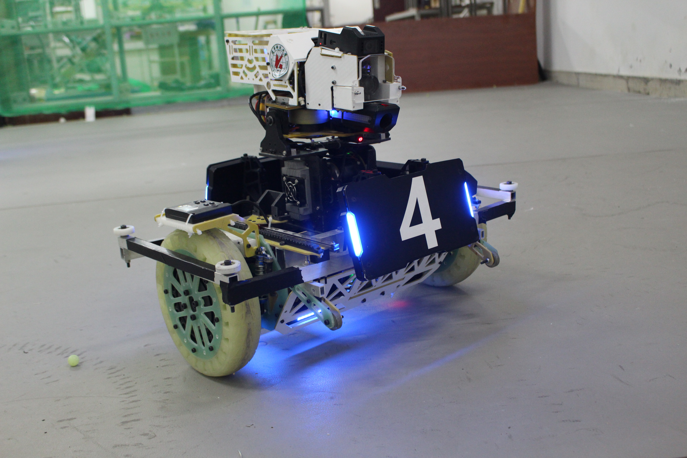
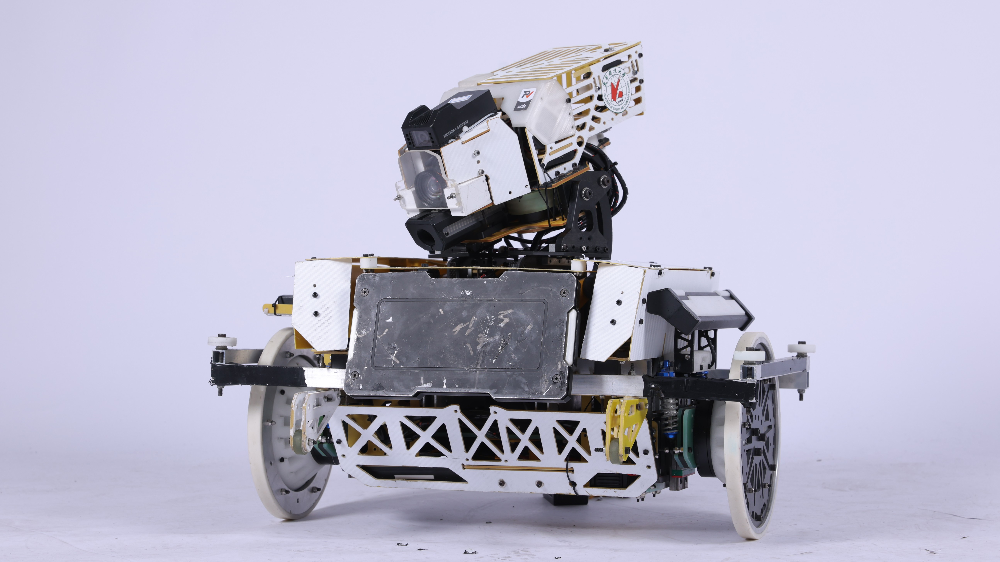

# Balance_Infantry
> 2023  Balance Infantry USTL COD

一代



二代



## 依赖工具及软硬件环境

依赖工具：Keil5,VsCode

软件环境：Windows11

硬件环境：STM32F407

## 编译器及编译方式

Arm Compiler 5

C/C++编译

## 简介

```
Balance Infantry
  ├───Chassis : 平衡步兵底盘代码
  ├───Gimbal : 平衡步兵云台代码
  ├───balancce.mat : Matlab数据文件，记录上一次计算的权重矩阵和状态反馈控制器等
  ├───BalanceInfantry_LQR.md : 平衡步兵的状态空间方程及权重矩阵，由MATLAB实现
  ├───MATLAB.md : 简易倒立摆的状态空间方程，由MATLAB实现
  └───Python.md : 简易倒立摆的状态空间方程，由Python实现
```

## 特别鸣谢

1. 广东工业大学DynamicX战队[rm_controllers](https://github.com/rm-controls/rm_controllers)开源
2. 南京航空航天大学长空御风战队平衡步兵开源
